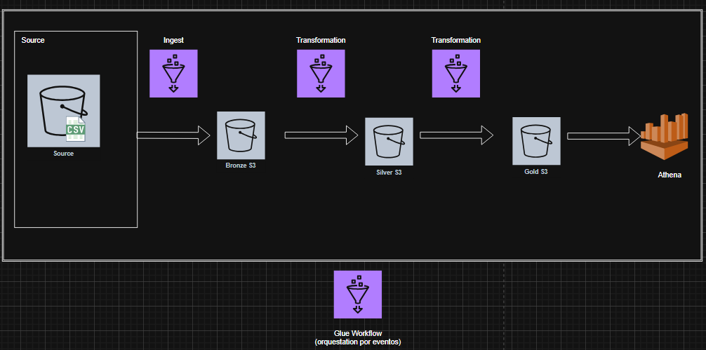

Se utiliza AWS Glue como orquestador, empleando su módulo de Workflows.

Se crean distintos buckets S3 organizados por capas:

source → datos de entrada.

bronze → datos crudos.

silver → datos transformados.

athena → resultados de consultas.

Se utiliza AWS Athena para visualizar y consultar los datos ya transformados y agregados del dataset.

